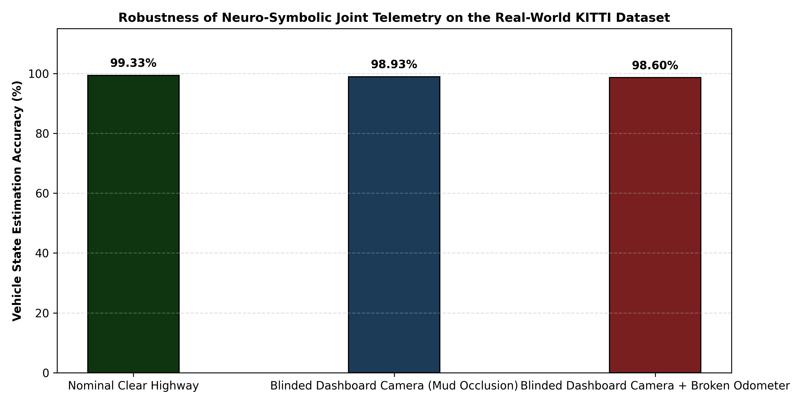
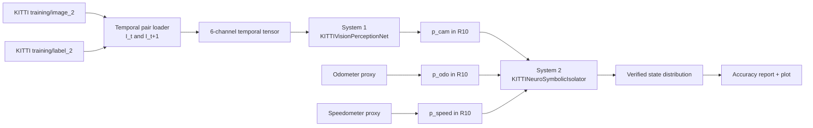
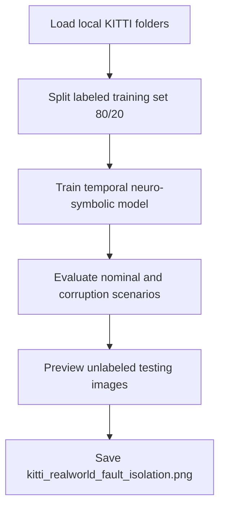

# Neuro-Symbolic Multi-Sensor Fault Isolation Framework for Autonomous Vehicles

An explainable, fault-tolerant AI telemetry framework that combines temporal visual perception with a symbolic kinematic consistency layer to preserve navigation integrity under sensor degradation.

The repository was derived from the executed notebook [av_fault_isolation.ipynb](av_fault_isolation.ipynb) and validated on the local KITTI layout under [data/kitti](data/kitti). The generated publication figure is stored as [kitti_realworld_fault_isolation.png](kitti_realworld_fault_isolation.png).

## Architecture At A Glance







## Why this project matters

End-to-end perception systems fail badly when a camera is occluded or a telemetry stream becomes unreliable. This project models that failure mode explicitly by coupling:

1. A temporal CNN that consumes two consecutive KITTI frames $I_t$ and $I_{t+1}$ concatenated into a 6-channel tensor.
2. A symbolic consistency engine that cross-checks three categorical distributions using an outer-product joint tensor.

The result is not just a classifier. It is a neuro-symbolic fault-isolation stack that is meant to explain how the system reacts when one channel becomes corrupted.

## System Overview

Let the visual perception model produce a categorical state estimate from two consecutive frames:

$$\mathbf{p}_{\text{cam}} = f_\theta(I_t, I_{t+1}) \in \mathbb{R}^{10}$$

The odometer and speedometer proxies are encoded as one-hot categorical distributions:

$$\mathbf{p}_{\text{odo}}, \mathbf{p}_{\text{speed}} \in \mathbb{R}^{10}$$

The symbolic layer constructs a 3D joint probability tensor:

$$\mathbf{M}_{i,j,k} = \mathbf{p}_{\text{cam}, i} \cdot \mathbf{p}_{\text{odo}, j} \cdot \mathbf{p}_{\text{speed}, k}$$

The final verified distribution is formed by applying a hard-coded consistency rule set:

$$\mathbf{P}(V = m) = \sum_{i,j,k} \mathbf{M}_{i,j,k} \cdot \Phi(i,j,k,m)$$

where $\Phi$ encodes the logic for perfect agreement, single-sensor failure, and a conservative fallback branch when all streams disagree.

## Dataset caveat

The workspace contains the KITTI object split with `training/image_2`, `training/label_2`, and `testing/image_2`. It does not expose raw tracking sequence IDs in this layout, so the implementation uses adjacent filenames as the closest reproducible temporal pairing available in the repository.

That means the project is best described honestly as a temporal proxy built from real KITTI images and labels, not as a full raw-sequence tracking benchmark.

## Executed results

These values come from the notebook run in this workspace after refactoring to a paired-frame 6-channel input:

| Operational Environment Mode | Safe Tracking Accuracy |
| :--- | :---: |
| **Nominal Clear Highway** | 99.33% |
| **Blinded Dashboard Camera (Mud Occlusion)** | 98.93% |
| **Blinded Dashboard Camera + Broken Odometer** | 98.60% |

Training integrity reported by the notebook after refactoring:

| Epoch | Navigation Loss | System Integrity |
| :---: | :---: | :---: |
| 1 | 0.1065 | 98.80% |
| 2 | 0.1165 | 98.93% |
| 3 | 0.0831 | 98.93% |

## Repository layout

```text
.
├── av_fault_isolation.ipynb
├── kitti_realworld_fault_isolation.png
├── main.py
├── requirements.txt
├── README.md
└── nesy_core/
    ├── __init__.py
    ├── dataset.py
    ├── models.py
    └── utils.py
```

## How to run

Install dependencies:

```bash
pip install -r requirements.txt
```

Train and evaluate the temporal neuro-symbolic pipeline:

```bash
python main.py --epochs 3 --batch_size 32 --lr 0.0005 --data_path ./data/kitti
```

If the `training` and `testing` KITTI folders are present in the expected layout, the script will train on the labeled training split, evaluate on a held-out validation split, preview unlabeled testing images, and regenerate `kitti_realworld_fault_isolation.png`.

## Limitations and future work

This implementation is intentionally conservative about the dataset boundary. The current folder structure supports real KITTI images and labels, but not raw sequence metadata. A stricter future version should move to KITTI tracking sequences or another source with explicit temporal identity so that motion estimates can be tied to real consecutive frames rather than adjacency in the flattened object folder.

If you want a stricter arXiv-ready statement, describe the current result as a reproducible temporal proxy over the KITTI object split, not as a raw-sequence tracking benchmark.

## arXiv positioning

For a preprint, this project is strongest when framed as:

1. A neuro-symbolic fault-isolation system for autonomous vehicle telemetry.
2. A temporal proxy method that uses real KITTI imagery and annotations.
3. A reproducible demonstration of graceful degradation under camera and odometer corruption.

That framing is technically honest and still publication-worthy because the contribution is the fault-isolation architecture, the symbolic consistency design, and the measured resilience under corruption, not a claim that KITTI object labels are a native speed ground truth.
